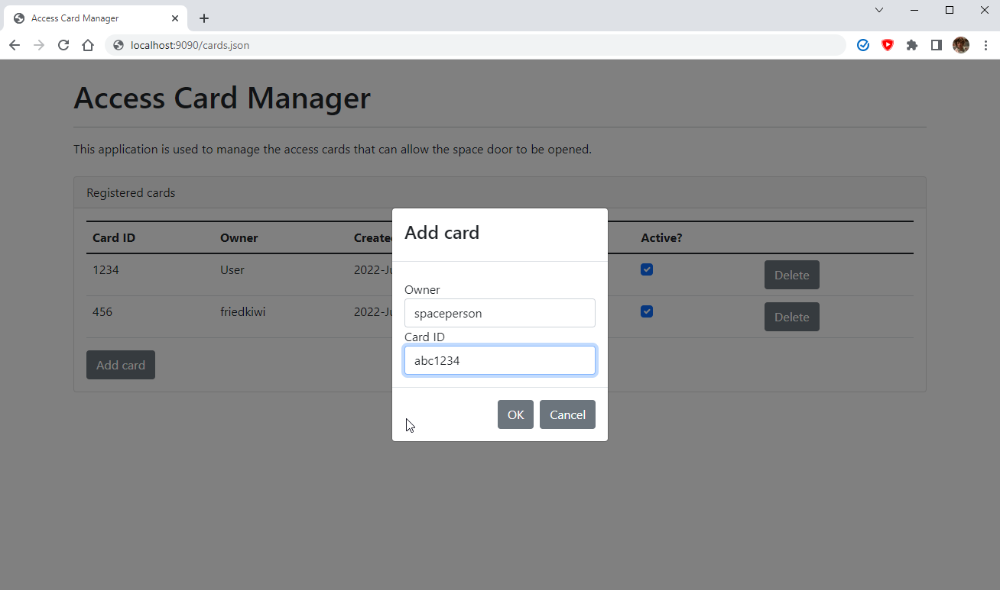
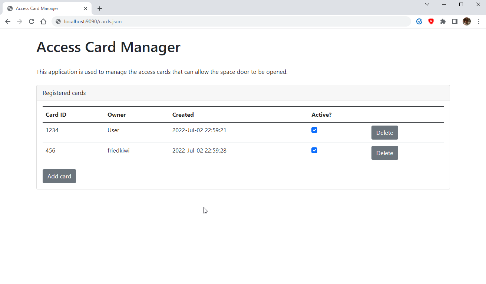

# access-card-manager

A simple tool to register and maintain access cards. Outputs a JSON file for the card readers to consume.

## Building

Dependencies:

    apt install build-essential pkg-config cmake libboost-all-dev libjsoncpp-dev

## Running using Docker

Build the Docker container using `docker build . -t access-card-manager`. Create an empty cards.json file using `touch /path/to/cards.json`. Then run the container using `docker run -p 9090:9090 -v /path/to/cards.json:/static/cards.json  access-card-manager`.

## Usage

The `cards.json` file can either be served directly using your favourite method, or accessed using http://localhost:9090/cards.json and then parsed from a card reader. The web UI to manage the cards should be fairly straightforward:

There is currently no auth/az. Just use nginx or similar to add basic auth and allow access to /cards.json.

